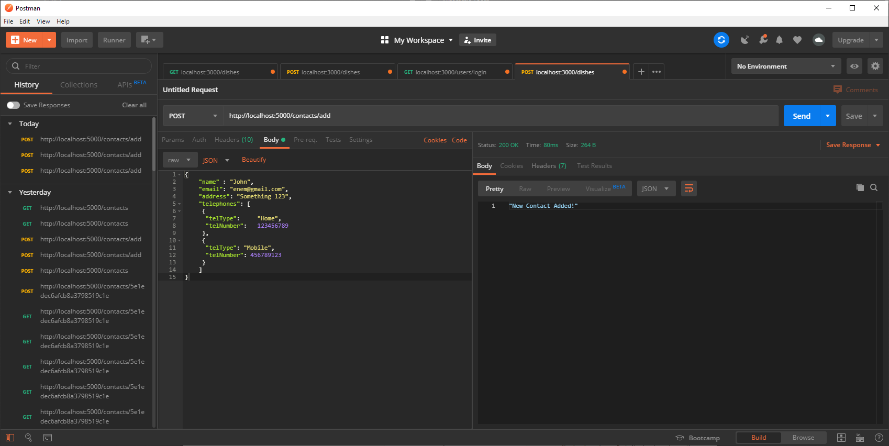

# Dataverse Assignment

## Εκφώνηση

Χρειάζεται να υλοποιήσετε μια απλή εφαρμογή στην οποία θα εμφανίζεται μια λίστα με προσωπικές επαφές. Στα βασικά στοιχεία θα είναι η Επωνυμία και το Email  ως υποχρεωτικά πεδία και η Διεύθυνση της επαφής ως προαιρετικό. Επίσης, κάθε επαφή θα έχει τη δυνατότητα προσθήκης ενός ή περισσοτέρων στοιχείων τηλεφώνου.

Η εφαρμογή θα πρέπει να δίνει την δυνατότητα προσθήκης, επεξεργασίας και διαγραφής μιας επαφής, με έλεγχο για την ορθότητα των δεδομένων (validation στο τηλέφωνο και το email). Στη διαγραφή θα πρέπει να εμφανίζεται ένα μήνυμα για την επιβεβαίωση της διαγραφής από τον χρήστη.

Οι τεχνολογίες που θα πρέπει να χρησιμοποιήσετε για την κατασκευή του project είναι: στο back-end Node.js και Express.js για βάση δεδομένων MongoDB και στο front-end React.js
Η αξιολόγηση της υλοποίησης θα γίνει βάσει των παρακάτω κριτηρίων:

Ευκολία ανάγνωσης και κατανόησης του κώδικα.
Ορθή υλοποίηση των ζητούμενων λειτουργιών.
Εμφάνιση και φιλικότητα περιβάλλοντος διεπαφής.
Σχόλια στα σημεία που χρειάζεται.

## Απάντηση

### Back-End

Το Back-End δημιουργήθηκε επιτυχώς με operations

| Λειτουργία    | Επεξήγηση              | Σύνδεσμος                                                                              |
|---------------|------------------------|----------------------------------------------------------------------------------------|
| Post          | Δημιουργία Νέας Επαφής | [http://localhost:5000/contacts/add](http://localhost:5000/contacts/add)               |
| Get           | Λήψη όλων των επαφών   | [http://localhost:5000/contacts](http://localhost:5000/contacts)                       |
| Update        | Επεξεργασία Επαφής     | [http://localhost:5000/contacts/update/:id](http://localhost:5000/contacts/update/:id) |
| Delete        | Διαγραφή Επαφής        | [http://localhost:5000/contacts/](http://localhost:5000/contacts/)                     |

και με τις ακόλουθες τεχνολογίες

- Node.JS
- ExpressJS
- MongoDB

αλλά όμως δεν συμπεριλήφθηκε:

- η ορθότητα των δεδομένων (validation)
- φιλικά μηνύματα (erorr messages ) προς τον χρήστη σε περίπτωση σφαλμάτων
- User Authentication

Ο λόγος: αφιερώθηκε περισσότερος χρόνος στο Front-End.

Δείγμα εισαγωγής νέας επαφής σε μορφή JSON και με χρήση Postman

```json
{
  "name" : "John",
  "email": "enem@gmail.com",
  "address": "Something 123",
  "telephones": [
   {
    "telType":     "Home",
    "telNumber":   123456789
   },
   {
    "telType": "Mobile",
    "telNumber": 456789123
   }
  ]
}
```



### Front-End

Στο Front-End στις Φόρμες Επικοινωνίας παρατηρήθηκαν τα εξής προβλήματα

- Οι λειτουργίες της φόρμας δεν είναι πλήρης όπως αναγράφεται στο επίσημο documentation της React [εδώ](https://reactjs.org/docs/forms.html). Το validation γίνεται είτε με Redux είτε με κάποιο Module όπως [Formik](https://jaredpalmer.com/formik), [React Hook Forms](https://react-hook-form.com/). Επιλέχθηκε η χρήση React Hook Forms
- Έγινε Χρήση Bootstrap 4 σε CSS αλλά οι λειτουργίες του Bootstrap 4 δεν είναι πλήρης.
